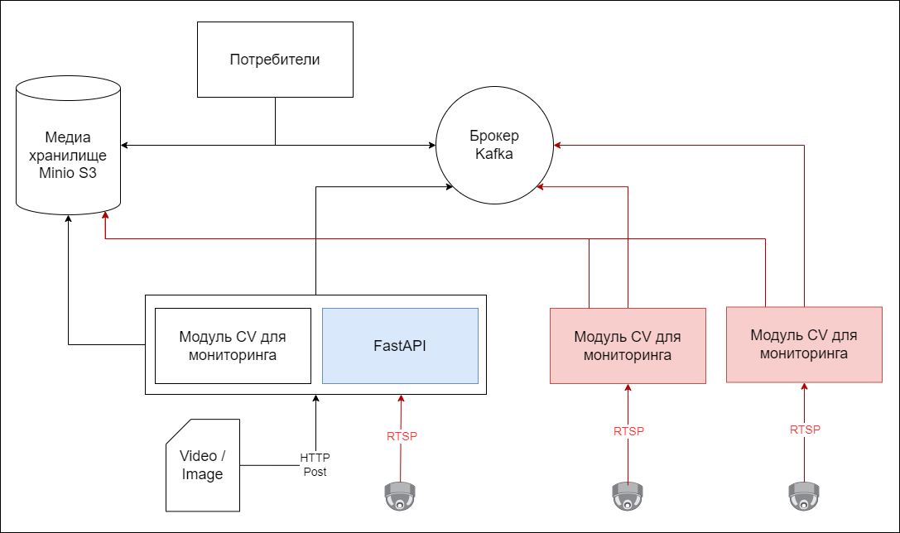

## Как использовать

### Docker Compose
Для выполнения следующих шагов вам понадобится установленный Docker. Для создания и запуска образа используйте следующую команду:

```bash
> docker-compose up --build
```

Конфигурация создаст кластер с 7 контейнерами:

- consumer - Потребитель: модель слушающий сервер kafka и обрабатывающий события 
- yolo - Модуль компьютерного зрения с FastAPI внутри
- kafka - сервер брокера-кафки
- kafdrop - сервер с UI для кафки
- zookeeper - модуль управляющий кластером кафки 
- minio - Сервер медиа-зранилища
- telebot - телеграмм бот для демонстрации

Контейнер yolo(основной контейнер для демонстрации) создаст RESTful API, который отправляет данные в Kafka и Minio. После поднятия будет доступен по адресу `http://localhost:8000`.

Контейнер Consumer — это скрипт, предназначенный для ожидания и получения сообщений от Kafka.

Контейнер kafdrop предоставит доступ к веб-интерфейсу для просмотра тем Kafka и просмотра групп потребителей, доступ к которым можно получить по адресу `http://localhost:19000`.

Доступ к веб-интерфейсу Minio S3 для проверки данных можно получить по адресу `http://localhost:9001`. 
``` 
user: minioadmin | psw: minioadmin
```

### FastAPI Swagger

Swagger - интерактивная документация по API, будет доступна по адресу `http://localhost:8000/docs`.


### Схема сервиса



## Структура проекта
Ниже представлена созданная структура проекта:
```cmd
.
├── README.md
├── docker-compose.yml
├── weights/ <# weight folder>
├── data/ <# sample images / video>
└── services
    ├── consumer
    │   └── <kafka consumer>
    │
    ├── telebot
    │   └── <telegram bot>
    │   
    ├── volume
    │   └── <pseudo_db for telegram bot>
    │
    └── yoloAPI
        ├── app
        │   ├── core
        │   │   ├── gateways/ <# init connections>
        │   │   ├── yolov5/ <# model>
        │   │   └── models/ <# schemas>
        │   │
        │   ├── dependencies/ <# checks existence of instances>
        │   │
        │   ├── routers/ <# API rotes>
        │   │   ├── detect.py <# detect | api method>
        │   │   ├── images.py <# images inference>
        │   │   ├── minio.py <# check minio connection | api method>
        │   │   ├── pipeline.py <# video inference | api method>
        │   │   ├── publisher.py <# check kafka connection | api method >
        │   │   └── video.py <video inference>
        │   │
        │   ├── templates/ 
        │   │   └── <*.html>
        │   │
        │   ├── utils/ 
        │   │   └── helpers.py <# usefull functions>
        │   │
        │   ├── enum.py <# EnvironmentVariables>
        │   └── main.py
        │
        ├── Dockerfile
        └── requirements.txt
```

## Переменные среды
Ниже перечислены переменные среды, необходимые для запуска приложения. Их нужно включить в docker-compose(уже настроены в docker-compose).

- Consumer:
```bash
KAFKA_TOPIC_NAME=
KAFKA_SERVER=
KAFKA_PORT=
TELETOKEN=
```

- YOLO
```bash
KAFKA_SERVER=
KAFKA_TOPIC_NAME=
KAFKA_PORT=
MINIO_HOST=
MINIO_PORT=
MINIO_USER=
MINIO_PASSWORD=
```

- Telebot
```bash
TELETOKEN=
```

## Ресурсы
Вы можете прочитать больше в документациях к инструментам:

- [aiokafka](https://aiokafka.readthedocs.io/en/stable/ka)
- [Docker](https://docs.docker.com/get-started/overview/)
- [FastAPI](https://fastapi.tiangolo.com)
- [Kafdrop](https://github.com/obsidiandynamics/kafdrop)
- [Kafka](https://kafka.apache.org)
- [Kafka-python](https://kafka-python.readthedocs.io/en/master/)
- [Minio-python](https://min.io/docs/minio/linux/developers/python/API.html)
